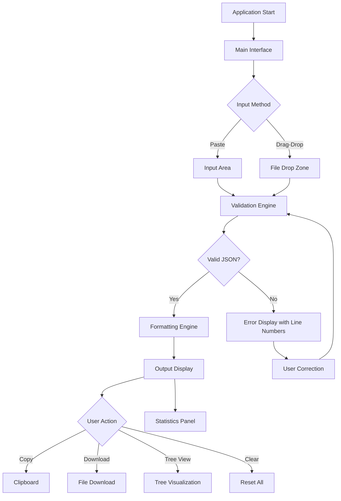

# JSON Formatter Pro - Product Requirements Document

## 1. Product Overview

JSON Formatter Pro is a professional, privacy-focused web application designed to format, validate, and prettify JSON data with exceptional performance and reliability. The tool addresses the critical challenges developers face when working with complex JSON structures in their daily workflow.

**Problem Statement:** Developers regularly encounter malformed JSON data from APIs, configuration files, and third-party integrations. Manual formatting is time-consuming, error-prone, and lacks visual clarity. Existing tools often compromise user privacy by sending data to external servers, and many fail to handle large files efficiently. Organizations and individual developers need a secure, high-performance solution that works entirely client-side while providing comprehensive validation feedback and intuitive visualization capabilities.

**Target Users:** The primary audience includes front-end developers, back-end engineers, DevOps professionals, data engineers, and technical product managers who regularly work with JSON APIs, configuration files, and data interchange formats. Secondary users include QA engineers, system administrators, and any technical professional who needs to validate or format JSON data quickly and reliably.

**Market Value:** The global developer tools market continues to expand rapidly, with JSON handling being a fundamental requirement across virtually all software development projects. A dedicated, high-performance JSON formatting solution addresses an essential daily need for millions of developers worldwide, positioning the product as a valuable utility in any developer's toolkit.

***

## 2. Core Features

### 2.1 User Roles

This application operates with a single user role, as all functionality is accessible without authentication. Users have full access to all formatting, validation, and export features without any restrictions or account requirements.

| Role       | Registration Method | Core Permissions                                                              |
| ---------- | ------------------- | ----------------------------------------------------------------------------- |
| Guest User | None required       | Full access to all formatting, validation, export, and configuration features |

### 2.2 Feature Module

The JSON Formatter Pro application consists of the following essential pages and modules:

1. **Main Interface:** Input area with syntax highlighting, toolbar with formatting controls, indentation selector, and output display area with tree view toggle.
2. **Configuration Panel:** Settings for indentation (2 spaces, 4 spaces, tabs), JSON5 toggle, and keyboard shortcut reference.
3. **Results Panel:** Validation status, error messages with precise line numbers, and formatting statistics.

### 2.3 Page Details

| Page Name      | Module Name          | Feature Description                                                                                                   |
| -------------- | -------------------- | --------------------------------------------------------------------------------------------------------------------- |
| Main Interface | Input Area           | Large text area for pasting or typing JSON content with real-time character counting and line number display          |
| Main Interface | Drag-Drop Support    | File drag-and-drop zone for .json and .txt files with visual feedback and automatic file reading                      |
| Main Interface | Real-Time Formatting | Automatic JSON formatting upon content change with configurable debounce delay (500ms default)                        |
| Main Interface | Indentation Options  | Dropdown selector for indentation style: 2 spaces, 4 spaces, or tabs with live preview                                |
| Main Interface | Syntax Validation    | Comprehensive JSON syntax checking including type validation, bracket matching, and structure verification            |
| Main Interface | Error Messages       | Detailed error reporting with exact line numbers, column position, and human-readable error descriptions              |
| Main Interface | Syntax Highlighting  | Color-coded JSON syntax including keys, strings, numbers, booleans, null values, and punctuation                      |
| Main Interface | Tree View            | Toggleable hierarchical tree visualization with collapse/expand functionality and node selection                      |
| Main Interface | Copy Function        | One-click copy to clipboard for formatted or minified output with confirmation toast notification                     |
| Main Interface | Download Function    | Download formatted JSON as .json file or minified version with custom filename support                                |
| Main Interface | Minify Function      | Compress JSON by removing all whitespace, producing single-line output for production use                             |
| Main Interface | Clear Function       | Reset input and output areas with confirmation dialog to prevent accidental data loss                                 |
| Main Interface | Loading States       | Visual progress indicator during file processing and large JSON operations with cancel option                         |
| Main Interface | Keyboard Shortcuts   | Full keyboard navigation including Ctrl/Cmd+Enter to format, Ctrl/Cmd+S to save, and standard text editing shortcuts  |
| Main Interface | JSON5 Support        | Extended JSON5 syntax support including single-line comments, trailing commas, unquoted keys, and hexadecimal numbers |
| Main Interface | Sample Generator     | Pre-built JSON samples including user data, API response, configuration object, and nested structures for testing     |
| Main Interface | Statistics Panel     | Real-time display of JSON size (original and formatted), line count, key count, and depth level                       |

***

## 3. Core Process

### User Operation Flow

**Standard User Flow:**

1. User opens the application and lands on the main interface
2. User pastes JSON content into the input area or drags a file onto the drop zone
3. Application automatically validates and displays errors if any exist
4. User configures indentation preference and optionally enables JSON5 mode
5. User selects formatting options (format, minify, or tree view)
6. Application processes JSON and displays formatted output with syntax highlighting
7. User copies formatted output to clipboard or downloads as file
8. User can clear all data and start fresh for the next task

**Advanced User Flow:**

1. User opens the application and accesses configuration panel
2. User adjusts indentation settings and keyboard shortcuts according to preference
3. User generates sample JSON to test formatting behavior
4. User pastes actual JSON data requiring validation
5. Application validates and displays detailed error messages with line numbers
6. User corrects errors and re-validates until all issues are resolved
7. User exports validated JSON in desired format

### Page Navigation Flowchart

***

## 4. User Interface Design

### 4.1 Design Philosophy

**Dark-Themed Minimalist SaaS Dashboard**

The JSON Formatter Pro interface embodies a modern, professional SaaS aesthetic with a sophisticated dark theme designed for extended use by developers and technical professionals. The design philosophy centers on reducing visual fatigue while maintaining optimal readability and accessibility across all user interactions. By employing a carefully curated color palette that balances depth with contrast, the interface creates an immersive development environment that feels premium yet unobtrusive. The minimalist approach eliminates unnecessary visual clutter, allowing users to focus entirely on their JSON data without distraction from decorative elements or excessive UI components.

**Core Design Principles:**

* **Visual Depth:** Multiple layers of dark tones create spatial hierarchy without relying on heavy shadows or borders, using subtle luminance differences to distinguish between interface layers
* **Content-First:** Every design decision prioritizes the JSON content, ensuring maximum screen real estate for data representation while maintaining intuitive access to controls
* **Reduced Cognitive Load:** Consistent patterns, clear visual hierarchy, and predictable interactions minimize the mental effort required to navigate and use the application
* **Professional Aesthetic:** The interface conveys technical competence and attention to detail through precise spacing, refined typography, and thoughtful micro-interactions

### 4.2 Color Palette

**Dark Theme Foundation:**

The color system utilizes a sophisticated dark palette designed for prolonged usage with minimal eye strain while maintaining excellent contrast for code readability and interface elements.

**Primary Colors:**

* **Canvas Background:** #0D1117 (deepest dark, used for main application background)
* **Surface Primary:** #161B22 (dark surface for panels, toolbars, and elevated components)
* **Surface Secondary:** #21262D (slightly lighter surface for hover states and interactive elements)
* **Surface Tertiary:** #30363D (lightest surface for borders, dividers, and subtle separation)

**Accent Colors (for visual hierarchy and interactive states):**

* **Primary Accent:** #58A6FF (soft blue, used for primary actions, links, and brand elements)
* **Secondary Accent:** #8B949E (neutral gray, used for secondary actions and inactive states)
* **Success Accent:** #3FB950 (vibrant green, used for valid states, success indicators, and confirmation actions)
* **Error Accent:** #F85149 (vivid red, used for errors, validation failures, and destructive actions)
* **Warning Accent:** #D29922 (warm amber, used for warnings and non-critical issues)
* **Info Accent:** #79C0FF (light blue, used for informational states and tooltips)

**Typography Colors:**

* **Text Primary:** #E6EDF3 (high-contrast white for main content, ensuring readability)
* **Text Secondary:** #8B949E (muted gray for labels, descriptions, and secondary information)
* **Text Tertiary:** #6E7681 (dimmed text for placeholders, disabled states, and metadata)
* **Text Inverse:** #0D1117 (dark text on light backgrounds for inverted contexts)

**Code Syntax Highlighting Colors:**

* **Keys:** #79C0FF (light blue)
* **Strings:** #A5D6FF (pale blue)
* **Numbers:** #79C0FF (light blue)
* **Booleans:** #FF7B72 (soft red)
* **Null:** #FF7B72 (soft red)
* **Brackets/Braces:** #E6EDF3 (white)
* **Commas/Colons:** #8B949E (gray)

**Functional State Colors:**

* **Valid JSON:** #3FB950 with subtle green glow effect
* **Invalid JSON:** #F85149 with subtle red pulse animation
* **Processing:** #D29922 with animated spinner
* **JSON5 Mode Active:** #58A6FF with indicator highlight

### 4.3 Typography System

**Typeface Selection:**

* **Primary Font:** 'Inter', system-ui, -apple-system, BlinkMacSystemFont for interface text
* **Monospace Font:** 'JetBrains Mono', 'Fira Code', 'SF Mono', Consolas for JSON display
* **Numeric Font:** 'JetBrains Mono' with tabular nums for aligned data display

**Type Scale:**

| Element | Size | Weight | Line Height | Letter Spacing | Color |
|---------|------|--------|-------------|----------------|-------|
| Page Title | 28px | 600 | 1.3 | -0.02em | Text Primary |
| Section Header | 20px | 600 | 1.4 | -0.01em | Text Primary |
| Subsection Header | 16px | 600 | 1.5 | 0 | Text Primary |
| Body Large | 15px | 400 | 1.6 | 0 | Text Primary |
| Body Regular | 14px | 400 | 1.5 | 0 | Text Primary |
| Body Small | 13px | 400 | 1.4 | 0 | Text Secondary |
| Caption | 12px | 400 | 1.3 | 0.02em | Text Tertiary |
| Code Regular | 14px | 400 | 1.6 | 0 | Syntax Colors |
| Code Small | 12px | 400 | 1.5 | 0 | Syntax Colors |

**Font Features:**

* **Inter:** Optical sizing, tabular nums, ligatures off for interface
* **JetBrains Mono:** Ligatures enabled for code, contextual alternates off
* **Antialiasing:** Subpixel antialiasing for smooth text rendering on dark backgrounds
* **Hinting:** Full hinting for crisp rendering on all displays

### 4.4 Component Styling

**Button Styles:**

* **Primary Button:**
  * Background: Primary Accent (#58A6FF)
  * Text: Canvas Background (#0D1117)
  * Border: None
  * Corner Radius: 6px
  * Padding: 10px 16px
  * Font Size: 14px, Weight: 500
  * Hover: Lighten by 8%, subtle lift transform
  * Active: Darken by 4%, press effect
  * Focus: 2px ring in Primary Accent with 4px offset
  * Transition: 150ms ease-out

* **Secondary Button:**
  * Background: Surface Secondary (#21262D)
  * Text: Text Primary (#E6EDF3)
  * Border: 1px solid Surface Tertiary (#30363D)
  * Corner Radius: 6px
  * Padding: 10px 16px
  * Font Size: 14px, Weight: 500
  * Hover: Background Surface Tertiary (#30363D), Border lighten
  * Active: Background darken, scale 0.98
  * Focus: 2px ring in Primary Accent with 4px offset

* **Icon Button:**
  * Size: 36px × 36px
  * Background: Transparent
  * Border: None
  * Corner Radius: 8px
  * Icon Size: 18px × 18px
  * Icon Color: Text Secondary (#8B949E)
  * Hover: Background Surface Secondary (#21262D), Icon color Text Primary
  * Active: Background Surface Tertiary (#30363D)
  * Focus: 2px ring in Primary Accent

**Input Styles:**

* **Text Area:**
  * Background: Surface Primary (#161B22)
  * Border: 1px solid Surface Tertiary (#30363D)
  * Corner Radius: 8px
  * Padding: 16px
  * Font: Monospace, 14px
  * Text Color: Text Primary (#E6EDF3)
  * Placeholder: Text Tertiary (#6E7681)
  * Focus: Border Primary Accent (#58A6FF), subtle glow
  * Selection: Primary Accent with 30% opacity
  * Scrollbar: Custom styled, width 8px, track Surface Primary, thumb Surface Tertiary

* **Select/Dropdown:**
  * Background: Surface Primary (#161B22)
  * Border: 1px solid Surface Tertiary (#30363D)
  * Corner Radius: 6px
  * Padding: 8px 12px
  * Font Size: 14px
  * Arrow Icon: Chevron down, 16px, Text Secondary
  * Focus: Border Primary Accent, glow effect
  * Dropdown Menu: Surface Secondary, 1px border, shadow-lg

**Toggle/Switch:**

* **Track:**
  * Width: 44px, Height: 24px
  * Background: Surface Tertiary (#30363D)
  * Corner Radius: 12px
  * Transition: 200ms ease
* **Knob:**
  * Size: 20px × 20px
  * Background: Text Secondary (#8B949E)
  * Corner Radius: 50%
  * Center position with 2px margin
  * Transition: 200ms ease
* **Checked State:**
  * Background: Primary Accent (#58A6FF) with 60% opacity
  * Knob: Background #58A6FF
* **Hover:**
  * Track background lighten slightly
  * Knob scale 1.1

**Card/Panel:**

* **Background:** Surface Primary (#161B22)
* **Border:** 1px solid Surface Tertiary (#30363D)
* **Corner Radius:** 12px
* **Shadow:** None (minimalist approach using borders for depth)
* **Header Padding:** 16px
* **Content Padding:** 16px

**Tooltip:**

* **Background:** Surface Secondary (#21262D) with 95% opacity
* **Border:** 1px solid Surface Tertiary (#30363D)
* **Corner Radius:** 6px
* **Padding:** 8px 12px
* **Font Size:** 12px
* **Text Color:** Text Primary (#E6EDF3)
* **Max Width:** 240px
* **Shadow:** lg
* **Animation:** Fade in 150ms, slide up 4px

### 4.5 Spacing System

**Base Unit:** 4px (0.25rem)

**Spacing Scale:**

| Token | Size | Usage |
|-------|------|-------|
| xs | 4px | Tight spacing, inline elements |
| sm | 8px | Between related elements |
| md | 12px | Standard component padding |
| lg | 16px | Default section spacing |
| xl | 24px | Major section separation |
| 2xl | 32px | Page section divisions |
| 3xl | 48px | Large area separation |
| 4xl | 64px | Maximum spacing |

**Layout Spacing:**

* **Page Margins:** 24px (desktop), 16px (tablet), 12px (mobile)
* **Component Gap:** 16px (standard), 24px (major components)
* **Section Padding:** 24px (outer), 16px (inner)
* **Content Padding:** 16px (standard), 24px (generous)

### 4.6 Layout Structure

**Global Layout:**

* **Header:** Fixed height 56px, full width, Surface Primary, bottom border 1px Surface Tertiary
* **Main Container:** Full remaining height, flexible width
* **Toolbar:** Height 48px, background Surface Secondary, border-bottom 1px Surface Tertiary
* **Content Area:** Flexible height, split-pane layout
* **Footer:** Fixed height 32px, Surface Primary, border-top 1px Surface Tertiary

**Split-Pane Design:**

* **Orientation:** Vertical split (left input, right output)
* **Default Ratio:** 50/50
* **Minimum Width:** 300px per pane
* **Divider:** 4px width, Surface Tertiary, grab cursor
* **Resize Handle:** Animated transition, snap points at 25/50/75%

**Responsive Breakpoints:**

* **Small Mobile:** < 480px (single column, stacked)
* **Large Mobile:** 480px - 768px (single column, adjusted sizing)
* **Tablet:** 768px - 1024px (single column with sidebar options)
* **Desktop:** 1024px - 1280px (split-pane default)
* **Large Desktop:** > 1280px (split-pane with enhanced features)

### 4.7 Icon System

**Icon Specifications:**

* **Viewbox:** 24px × 24px
* **Stroke Width:** 1.5px (standard), 2px (emphasis)
* **Line Cap:** Round
* **Line Join:** Round
* **Corner Radius:** 2px (for rounded elements)
* **Style:** Minimalist outline icons with consistent weight

**Icon Colors:**

* **Default:** Text Tertiary (#6E7681)
* **Hover:** Text Secondary (#8B949E)
* **Active:** Text Primary (#E6EDF3)
* **Accent:** Primary Accent (#58A6FF)
* **Success:** Success Accent (#3FB950)
* **Error:** Error Accent (#F85149)

**Icon Set (Essential Icons):**

* Format/Indent (spaces/tabs toggle)
* Copy to clipboard
* Download file
* Clear/Reset
* Minify
* Expand/Collapse tree nodes
* JSON5 mode toggle
* Error/Warning indicators
* Validation status (check/X)
* File drop zone
* Keyboard shortcuts
* Sample JSON
* Theme toggle (future dark/light)

### 4.8 Micro-Interactions & Animations

**Transition Specifications:**

* **Fast:** 100ms (hover states, toggle switches)
* **Standard:** 200ms (buttons, inputs, panels)
* **Slow:** 300ms (modals, tooltips, large panels)
* **Ease Curves:** ease-out (most), ease-in-out (complex), spring (interactive elements)

**Animation Types:**

* **Fade:** Opacity 0 → 1, used for tooltips, modals, notifications
* **Slide:** Translate Y -4px → 0, used for dropdowns, tooltips
* **Scale:** Scale 0.95 → 1, used for buttons, cards, dialogs
* **Spin:** Rotate 0 → 360, used for loading spinners
* **Pulse:** Opacity/Scale oscillation, used for errors, notifications
* **Highlight:** Background flash, used for copy confirmation

**Loading States:**

* **Spinner:** Primary accent color, 24px, standard rotation
* **Progress Bar:** Primary accent, indeterminate animation
* **Skeleton:** Pulse animation on placeholder blocks
* **Text:** "Processing..." with animated ellipsis

### 4.9 Accessibility Features

**Keyboard Navigation:**

* **Tab Order:** Logical, consistent across all interactive elements
* **Focus Indicators:** 2px Primary Accent ring with 4px offset
* **Shortcuts:** Well-documented, non-conflicting, mnemonic where possible
* **Skip Links:** Skip to main content, skip to toolbar

**Screen Reader Support:**

* **ARIA Labels:** All interactive elements labeled
* **Live Regions:** Status updates announced (validation results, errors)
* **Role Attributes:** Proper semantic roles (button, textbox, tree, etc.)
* **Error Associations:** Error messages linked to inputs via aria-describedby

**Contrast Compliance:**

* **WCAG AA:** Minimum 4.5:1 for normal text, 3:1 for large text
* **Focus Indicators:** Minimum 3:1 contrast ratio
* **Status Colors:** Icons used alongside color for colorblind accessibility

### 4.10 Page Design Overview

| Page Name | Module Name | UI Elements |
|-----------|-------------|-------------|
| Main Interface | Header | Logo/brand (18px), title (16px, 600), documentation link, theme toggle, user menu (future) |
| Main Interface | Toolbar | Indentation dropdown (2/4/tabs), JSON5 toggle switch (44px), Format button (primary), Minify button (secondary), Clear button (secondary), Sample dropdown, Keyboard shortcuts button (icon) |
| Main Interface | Main Content | Split pane with resizable divider (4px), input textarea with line numbers (monospace), output display with syntax highlighting, full-height panels |
| Main Interface | File Drop Zone | Full overlay zone, dashed border (2px, Surface Tertiary), centered drop icon (48px), "Drop JSON file here" text (14px), drag-enter highlight |
| Main Interface | Tree View Panel | Collapsible tree structure with chevron icons, expand/collapse animations, node highlighting on hover, scrollable container with sticky headers |
| Main Interface | Status Indicator | Validation badge (green check/red X), error count badge, last processed timestamp, file size comparison |
| Main Interface | Error Panel | Slide-in panel from right or bottom, error icon, line number badge (pill shape), error message, character position, suggested fix when available |
| Main Interface | Statistics Bar | Size comparison (before/after with visual indicator), line count, key count, depth level indicators, processing time (ms) |
| Main Interface | Footer | Privacy notice ("Processed locally - no data leaves your browser"), keyboard shortcuts reference (Ctrl+Enter, Ctrl+L), version number (semantic), keyboard shortcut cheat sheet modal |

### 4.11 Responsiveness Strategy

**Desktop-First Approach:**

* **Optimal Experience:** 1280px+ viewports with full feature visibility
* **Toolbar:** All actions visible without scrolling
* **Split-Pane:** Default 50/50 with adjustable divider, visual resize handles
* **Keyboard Shortcuts:** Full documentation, discoverable via help modal
* **Code Display:** Syntax highlighting with horizontal scroll for long lines
* **Tree View:** Smooth expand/collapse animations, virtual scrolling for large trees

**Tablet Adaptation (768px - 1024px):**

* **Layout:** Single-pane with tab toggle (Input/Output/Tree View)
* **Toolbar:** Condensed, some buttons with icons only
* **Spacing:** Reduced margins (16px), compact component sizing
* **Touch Targets:** Minimum 44px for touch interactions
* **Gestures:** Swipe between Input/Output/Tree views

**Mobile Adaptation (< 768px):**

* **Layout:** Single column, stacked Input → Output → Tree
* **Toolbar:** Icon-only actions, overflow menu for secondary features
* **Touch:** Full touch optimization, swipe gestures for navigation
* **Keyboard:** Virtual keyboard handling with proper scrolling
* **Performance:** Reduced animations, simplified animations
* **File Handling:** Sheet-based file picker, drag-drop disabled

**Responsive Type Scale:**

* **Desktop:** Base 14px, scale 1.125 (Major Third)
* **Tablet:** Base 13px, scale 1.125
* **Mobile:** Base 13px, scale 1.2 (Major Third)

### 4.12 Visual States & Feedback

**Validation States:**

* **Valid JSON:**
  * Badge: Green pill with check icon
  * Border: Subtle green glow (2px, 20% opacity)
  * Animation: Subtle pulse on status indicator
  * Sound: Optional notification sound (configurable)

* **Invalid JSON:**
  * Badge: Red pill with X icon, error count badge
  * Border: Red glow animation (2px, 30% opacity)
  * Error Panel: Auto-expanded showing first error
  * Error Line: Highlighted in input area with underline
  * Sound: Optional error notification

* **Processing:**
  * Cursor: Wait cursor with spinner overlay
  * Button: Disabled state with spinner
  * Status: "Processing..." with progress indicator
  * Input: Read-only during processing

**File Handling States:**

* **Idle:** Ready for input, clear visual affordances
* **Drag Enter:** Highlighted drop zone, dashed border animated
* **Drag Over:** Full overlay, scaled background
* **Drop Processing:** File name display, progress indicator
* **Complete:** Success animation, stats display
* **Error:** Error message, retry option

**Interaction Feedback:**

* **Hover:** Subtle background change, icon color shift
* **Active:** Scale down 0.98, color saturation increase
* **Focus:** Primary accent ring, offset 4px
* **Success:** Green check animation, brief pulse
* **Error:** Red shake animation, error message display

***

## 5. Performance Requirements

### 5.1 Large File Support

* **Maximum File Size:** 10MB (approximately 50,000+ lines of typical JSON)

* **Memory Efficiency:** Streaming-based parsing for files exceeding 5MB to prevent browser memory exhaustion

* **Progressive Rendering:** Display results incrementally for large files without blocking UI

* **Lazy Loading:** Tree view loaded on-demand for large JSON structures to minimize initial render time

* **Worker Thread:** JSON parsing and formatting executed in Web Worker to prevent UI blocking

### 5.2 Processing Time Metrics

| Operation              | Maximum Acceptable Time        | Target Performance |
| ---------------------- | ------------------------------ | ------------------ |
| JSON validation (1KB)  | < 100ms                        | < 50ms             |
| JSON formatting (1KB)  | < 200ms                        | < 100ms            |
| JSON validation (1MB)  | < 2 seconds                    | < 1 second         |
| JSON formatting (1MB)  | < 3 seconds                    | < 1.5 seconds      |
| JSON validation (10MB) | < 10 seconds                   | < 5 seconds        |
| JSON formatting (10MB) | < 15 seconds                   | < 8 seconds        |
| Tree view generation   | < 2 seconds for initial render | < 1 second         |
| Syntax highlighting    | < 500ms for 10,000 lines       | < 300ms            |
| Copy to clipboard      | < 200ms                        | < 100ms            |
| File download (10MB)   | < 3 seconds                    | < 1.5 seconds      |

### 5.3 Optimization Strategies

* **Debounced Input:** Real-time validation with 300-500ms debounce to prevent excessive processing

* **Virtual Scrolling:** Infinite scroll with virtualization for large JSON displays

* **Code Splitting:** Lazy load tree view and sample generator modules

* **Memoization:** Cache formatting results for unchanged input

* **Web Workers:** Offload heavy JSON processing to background threads

* **Binary Protocol:** Use ArrayBuffer for file operations when possible

***

## 6. Browser Compatibility

### 6.1 Supported Browsers

| Browser         | Minimum Version | Requirements                                                                          |
| --------------- | --------------- | ------------------------------------------------------------------------------------- |
| Google Chrome   | 90+             | Full support including all modern JavaScript features, Web Workers, and Clipboard API |
| Mozilla Firefox | 88+             | Full support with consistent rendering and ES2021+ features                           |
| Apple Safari    | 14+             | Full support with iOS 14+ mobile equivalent, note potential Clipboard API limitations |
| Microsoft Edge  | 90+             | Full support identical to Chrome due to Chromium base                                 |
| Opera           | 76+             | Full support due to Chromium base                                                     |

### 6.2 Feature Support Requirements

* **JavaScript Features:** ES2021 minimum (optional chaining, logical assignment, Promise.allSettled)

* **Web Workers:** Required for background processing without UI blocking

* **Clipboard API:** Primary method for copy functionality with fallback to execCommand

* **File API:** Drag-and-drop file reading with FileReader interface

* **CSS Variables:** For theming support and dynamic color adjustment

* **Flexbox and Grid:** Modern CSS layout for responsive design

* **Local Storage:** Optional for saving user preferences across sessions

* **Service Worker:** Optional for offline capability (future enhancement)

### 6.3 Polyfill Considerations

* No external polyfills required for target browser versions

* Core functionality works without JavaScript frameworks

* Graceful degradation for browsers with limited ES6+ support

* Clear error messages for unsupported browser configurations

***

## 7. Technical Constraints

### 7.1 Client-Side Only Architecture

* **Zero Server Dependencies:** All JSON processing occurs entirely within the user's browser

* **No Data Transmission:** No JSON data is ever sent to external servers under any circumstances

* **Offline Capability:** Fully functional without internet connection after initial page load

* **Local Processing:** All formatting, validation, and tree view generation performed client-side

* **No Backend Required:** Eliminates server infrastructure costs and maintenance complexity

* **Immediate Results:** No network latency for validation and formatting operations

### 7.2 Privacy-Focused Design

* **Data Sovereignty:** All user data remains on the user's device

* **No Tracking:** Zero analytics, cookies, or fingerprinting scripts

* **No External Requests:** Application makes no network requests beyond loading initial resources

* **Local Storage Only:** User preferences stored locally, never transmitted

* **No Third-Party Services:** No integration with external APIs, CDNs, or analytics platforms

* **Open Source Friendly:** Code structure allows for self-hosting and security auditing

* **GDPR Compliant:** By design, no personal data collection occurs

* **Memory Hygiene:** Sensitive data cleared from memory when session ends or user clears input

### 7.3 Security Considerations

* **XSS Prevention:** Input sanitization prevents cross-site scripting through JSON content

* **CSP Headers:** Content Security Policy prevents unauthorized script execution

* **Same-Origin Policy:** Enforced by browser, no cross-origin data exposure

* **Memory Safety:** No sensitive data caching in variables beyond necessary scope

* **Clipboard Security:** Clipboard operations require explicit user action only

***

## 8. Success Metrics

### 8.1 Validation Accuracy

| Metric                          | Target | Measurement Method                                                                                               |
| ------------------------------- | ------ | ---------------------------------------------------------------------------------------------------------------- |
| JSON Syntax Validation Accuracy | 100%   | Detection of all standard JSON syntax errors including structural issues, type mismatches, and malformed content |
| Error Message Precision         | 95%+   | Errors correctly identified at specific line and column positions                                                |
| JSON5 Parsing Accuracy          | 100%   | Correct parsing of all valid JSON5 constructs including comments, trailing commas, and unquoted keys             |
| Recovery Behavior               | 90%+   | Meaningful error messages for malformed JSON that provide actionable feedback                                    |
| Format Preservation             | 100%   | Original JSON semantics preserved after formatting cycle (round-trip fidelity)                                   |

### 8.2 Performance Benchmarks

| Metric                              | Minimum Acceptable  | Target         | Measurement Method                                      |
| ----------------------------------- | ------------------- | -------------- | ------------------------------------------------------- |
| Small File (<100KB) Validation Time | < 100ms             | < 50ms         | Time from input completion to validation result display |
| Small File (<100KB) Formatting Time | < 200ms             | < 100ms        | Time from format request to formatted output display    |
| Medium File (1MB) Processing Time   | < 3 seconds         | < 1.5 seconds  | Total time for validation and formatting combined       |
| Large File (10MB) Processing Time   | < 15 seconds        | < 8 seconds    | Total time including progressive rendering              |
| UI Responsiveness                   | No blocking > 100ms | Zero blocking  | Main thread never frozen during processing              |
| Memory Usage (10MB file)            | < 500MB             | < 300MB        | Peak memory consumption during large file operations    |
| Tree View Render Time (10K nodes)   | < 2 seconds         | < 1 second     | Time to render initial tree view with virtualization    |
| Typing Responsiveness               | < 50ms latency      | < 30ms latency | Time from keypress to character appearing in input      |

### 8.3 User Experience Metrics

| Metric                 | Target  | Measurement Method                                                      |
| ---------------------- | ------- | ----------------------------------------------------------------------- |
| Task Completion Rate   | 95%+    | Percentage of users successfully completing formatting/validation tasks |
| Error Recovery Success | 90%+    | Users able to resolve JSON errors using provided error messages         |
| Feature Discovery      | 80%+    | Users aware of at least 5 key features within first session             |
| Satisfaction Score     | 4.5/5.0 | Post-session user rating (qualitative feedback collection)              |
| Return User Rate       | 40%+    | Users returning within 30 days for subsequent tasks                     |
| Mobile Usability Score | 4.0/5.0 | Mobile user satisfaction with responsive design                         |

### 8.4 Reliability Metrics

| Metric                    | Target | Measurement Method                                           |
| ------------------------- | ------ | ------------------------------------------------------------ |
| Crash-Free Sessions       | 99.9%  | Zero crashes or unhandled exceptions during normal operation |
| Data Loss Incidents       | 0      | Unintentional data loss events                               |
| Cross-Browser Consistency | 100%   | Identical validation results across all supported browsers   |
| Session Stability         | 99.5%  | Sessions remaining active without refresh requirement        |
| Export Accuracy           | 100%   | Downloaded files matching formatted output exactly           |

***

## 9. Future Enhancements

While outside the current scope, potential future enhancements include:

* **Schema Validation:** Support for JSON Schema validation with visual schema editor

* **Multiple Format Support:** XML, YAML, and CSV conversion capabilities

* **API Integration:** Direct URL fetching for validation against remote JSON endpoints

* **Collaboration Features:** Share formatted JSON via unique URL (with privacy-preserving approach)

* **Plugin System:** Browser extensions and IDE integration

* **Batch Processing:** Multiple file handling and comparison views

* **History Management:** Local session history with diff comparison

* **Custom Themes:** User-defined color schemes and syntax highlighting preferences

* **Command Line Interface:** CLI version for terminal-based workflows

