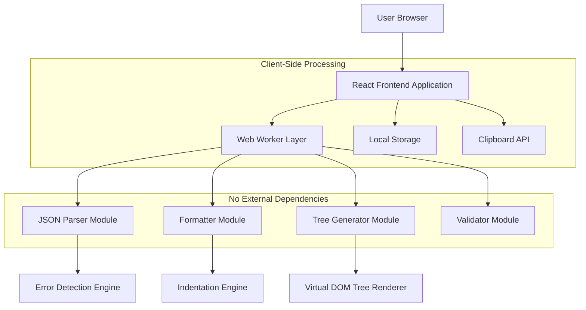
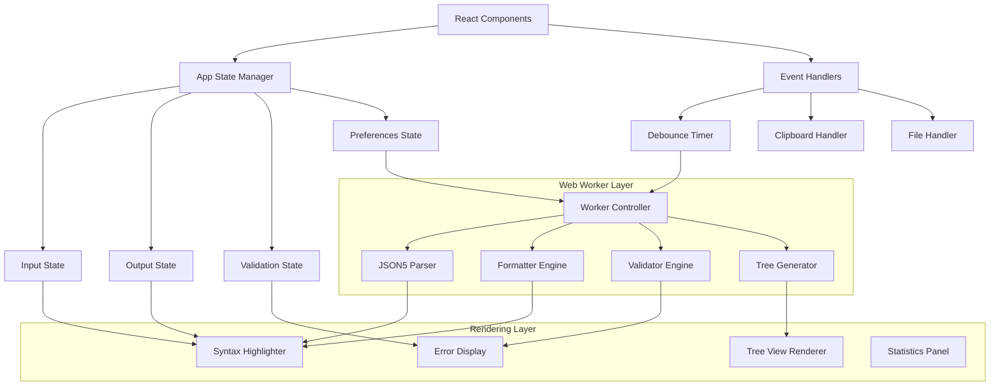
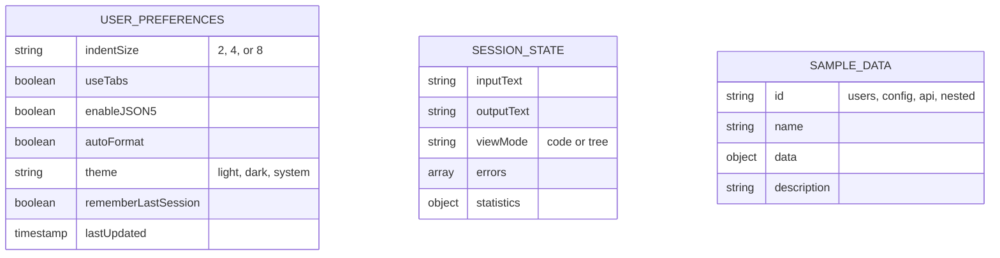

# JSON Formatter Pro - Technical Architecture Document

## 1. Architecture Design



## 2. Technology Description

- **Frontend Framework:** React@18 with TypeScript for type-safe component development
- **Styling:** Tailwind CSS@3 for utility-first styling and responsive design
- **Build Tool:** Vite@5 for fast development and optimized production builds
- **State Management:** React Context API with useReducer for complex state management
- **Code Editor:** Custom textarea with overlay syntax highlighting (lightweight alternative to Monaco)
- **JSON Processing:** Custom JSON5-compatible parser and formatter implementation
- **Virtualization:** react-window or custom virtual scrolling for large file rendering
- **Icons:** Lucide React for consistent, lightweight icon set
- **Utilities:** date-fns for timestamp formatting (minimal footprint)

## 3. Route Definitions

| Route | Purpose |
|-------|---------|
| / | Main application interface with JSON input/output and all formatting features |
| /?sample={type} | Direct link with pre-loaded sample JSON (users, config, api, nested) |
| /#shortcuts | Main view scrolled to keyboard shortcuts reference section |

## 4. Data Model

### 4.1 JSON Processing Types

```typescript
// Core JSON Processing Types

interface JSONError {
  line: number;
  column: number;
  message: string;
  code: 'SYNTAX_ERROR' | 'TYPE_ERROR' | 'MISSING_BRACKET' | 'INVALID_VALUE' | 'UNKNOWN';
  suggestedFix?: string;
}

interface FormattingOptions {
  indentSize: 2 | 4 | 8;
  useTabs: boolean;
  enableJSON5: boolean;
  maxLineLength?: number;
  quoteStyle: 'single' | 'double' | 'preserve';
}

interface ProcessingResult {
  success: boolean;
  data?: unknown;
  errors?: JSONError[];
  statistics: {
    originalSize: number;
    formattedSize: number;
    lineCount: number;
    keyCount: number;
    maxDepth: number;
  };
  formattedOutput?: string;
  minifiedOutput?: string;
}

interface TreeNode {
  key: string | null;
  value: unknown;
  type: 'object' | 'array' | 'string' | 'number' | 'boolean' | 'null';
  depth: number;
  collapsed: boolean;
  children?: TreeNode[];
  path: string;
}

interface FileUpload {
  name: string;
  size: number;
  type: string;
  content: string;
}

interface UserPreferences {
  indentSize: 2 | 4 | 8;
  useTabs: boolean;
  enableJSON5: boolean;
  autoFormat: boolean;
  theme: 'light' | 'dark' | 'system';
  rememberLastSession: boolean;
}

interface Statistics {
  characters: number;
  lines: number;
  keys: number;
  depth: number;
  originalSize: number;
  formattedSize: number;
  minifiedSize: number;
}
```

### 4.2 Component State Types

```typescript
interface AppState {
  inputText: string;
  outputText: string;
  errors: JSONError[];
  isProcessing: boolean;
  isJSON5Enabled: boolean;
  formattingOptions: FormattingOptions;
  viewMode: 'code' | 'tree';
  statistics: Statistics;
  uploadedFile: FileUpload | null;
}

interface ToolbarState {
  isJSON5Enabled: boolean;
  indentSize: 2 | 4 | 8;
  useTabs: boolean;
  isCopied: boolean;
  showShortcuts: boolean;
  showSamples: boolean;
}

interface ValidationState {
  isValid: boolean;
  errors: JSONError[];
  errorCount: number;
  lastValidated: number | null;
}
```

## 5. Server Architecture Diagram

This application operates entirely client-side with no backend server. All processing occurs within the browser using Web Workers for heavy computations.



## 6. Data Model Definition (If Applicable)

This client-side application uses in-memory JavaScript objects and LocalStorage for user preferences. No database is required as all JSON processing occurs dynamically without persistent storage of user data.



## 7. Component Architecture

### 7.1 Core Component Hierarchy

```
App
├── Header
│   ├── Logo
│   ├── Title
│   └── ThemeToggle
├── Toolbar
│   ├── IndentationDropdown
│   ├── JSON5Toggle
│   ├── FormatButton
│   ├── MinifyButton
│   ├── SampleDropdown
│   ├── ShortcutsButton
│   └── ClearButton
├── MainContent
│   ├── SplitPane
│   │   ├── InputPanel
│   │   │   ├── FileDropZone
│   │   │   ├── InputTextarea
│   │   │   └── LineNumbers
│   │   └── OutputPanel
│   │       ├── CodeView
│   │       │   └── SyntaxHighlighter
│   │       └── TreeView
│   │           └── TreeNode
├── ErrorPanel
│   ├── ErrorList
│   └── ErrorItem
├── StatisticsPanel
│   ├── SizeComparison
│   ├── LineCount
│   └── KeyCount
└── Footer
    ├── PrivacyNotice
    └── KeyboardShortcutsReference
```

### 7.2 Service Layer Architecture

```typescript
// Core Service Interfaces

interface IJSONParser {
  parse(input: string, enableJSON5: boolean): ProcessingResult;
  isValidJSON5(input: string): boolean;
}

interface IFormatter {
  format(input: string, options: FormattingOptions): string;
  minify(input: string): string;
  beautify(input: string, indentSize: number, useTabs: boolean): string;
}

interface IValidator {
  validate(input: string, enableJSON5: boolean): JSONError[];
  getErrorPosition(error: JSONError): { line: number; column: number };
}

interface ITreeGenerator {
  generateTree(data: unknown): TreeNode[];
  getNodePath(node: TreeNode): string;
  toggleNode(nodeId: string): void;
}

interface IFileHandler {
  readFile(file: File): Promise<string>;
  downloadFile(content: string, filename: string): void;
  getFileExtension(filename: string): string;
}

interface IClipboardHandler {
  copyToClipboard(text: string): Promise<boolean>;
  readFromClipboard(): Promise<string>;
}

interface IPreferencesManager {
  save(preferences: UserPreferences): void;
  load(): UserPreferences;
  reset(): void;
}
```

## 8. Web Worker Communication

### 8.1 Worker Message Protocol

```typescript
// Worker Message Types

interface WorkerRequest {
  id: string;
  type: 'PARSE' | 'FORMAT' | 'VALIDATE' | 'GENERATE_TREE' | 'MINIFY';
  payload: {
    input: string;
    options?: FormattingOptions;
    enableJSON5?: boolean;
  };
}

interface WorkerResponse {
  id: string;
  success: boolean;
  result?: ProcessingResult;
  error?: {
    message: string;
    stack?: string;
  };
}

type WorkerMessage = WorkerRequest | WorkerResponse;
```

### 8.2 Worker Pool Configuration

```typescript
interface WorkerPoolConfig {
  workerCount: number; // Default: navigator.hardwareConcurrency || 4
  taskQueue: WorkerRequest[];
  activeWorkers: Map<number, Worker>;
  maxRetries: number; // Default: 3
  timeout: number; // Default: 30000ms
}

// Efficient worker management for large file processing
const createWorkerPool = (config: WorkerPoolConfig): WorkerPool => {
  const workers: Worker[] = [];
  const taskQueue: WorkerRequest[] = [];
  
  // Initialize workers based on hardware concurrency
  for (let i = 0; i < config.workerCount; i++) {
    const worker = new Worker('./json-worker.js');
    workers.push(worker);
  }
  
  return { workers, taskQueue };
};
```

## 9. Performance Optimization Strategies

### 9.1 Rendering Optimizations

- **Memoization:** Heavy components wrapped with React.memo to prevent unnecessary re-renders
- **Virtual Scrolling:** Only render visible portion of large JSON arrays and objects
- **Debounced Input:** Real-time processing with configurable debounce (300-500ms)
- **Code Splitting:** Lazy load tree view and sample data components
- **CSS Containment:** Use CSS containment for improved browser rendering performance

### 9.2 Memory Management

- **WeakMap for Caching:** Use WeakMap for memoization to allow garbage collection
- **Streaming Large Files:** Process files in chunks to avoid memory exhaustion
- **Explicit Cleanup:** Clear Web Worker instances and event listeners on component unmount
- **Object Pooling:** Reuse TreeNode objects where possible to reduce allocations

### 9.3 Network Optimization

- **Zero Network Requests:** All processing occurs client-side after initial page load
- **Tree Shaking:** Vite removes unused code for minimal bundle size
- **Asset Optimization:** Compress icons and use SVG for scalability
- **Code Prefetching:** Preload sample data on application idle

## 10. Security Implementation

### 10.1 Input Sanitization

```typescript
// Sanitize JSON input to prevent XSS attacks
const sanitizeJSON = (input: string): string => {
  // Remove potential script injection patterns
  return input
    .replace(/<script\b[^<]*(?:(?!<\/script>)<[^<]*)*<\/script>/gi, '')
    .replace(/javascript:/gi, '')
    .replace(/on\w+=/gi, '');
};

// Validate file types before processing
const isValidJSONFile = (file: File): boolean => {
  const validTypes = ['application/json', 'text/plain'];
  const validExtensions = ['.json', '.txt'];
  
  return validTypes.includes(file.type) || 
         validExtensions.some(ext => file.name.endsWith(ext));
};
```

### 10.2 Content Security Policy

```html
<meta http-equiv="Content-Security-Policy" 
      content="default-src 'self'; 
               script-src 'self' 'unsafe-inline'; 
               style-src 'self' 'unsafe-inline'; 
               img-src 'self' data:;
               connect-src 'none';
               frame-ancestors 'none';">
```

## 11. Testing Strategy

### 11.1 Unit Testing Coverage

| Category | Coverage Target | Test Framework |
|----------|----------------|----------------|
| JSON Parser | 100% | Jest |
| Formatter | 100% | Jest |
| Validator | 100% | Jest |
| Tree Generator | 95%+ | Jest |
| Component Rendering | 90%+ | React Testing Library |
| Web Worker Integration | 100% | Jest + Web Worker Mock |

### 11.2 Performance Testing

- **Benchmark Suite:** Measure processing times for files of various sizes (1KB, 10KB, 100KB, 1MB, 10MB)
- **Memory Profiling:** Chrome DevTools memory tracking for large file operations
- **Stress Testing:** Concurrent operations to identify race conditions
- **Accessibility Testing:** Screen reader compatibility and keyboard navigation

## 12. Deployment Configuration

### 12.1 Build Configuration

```typescript
// vite.config.ts
import { defineConfig } from 'vite';
import react from '@vitejs/plugin-react';

export default defineConfig({
  plugins: [react()],
  build: {
    target: 'es2021',
    minify: 'esbuild',
    sourcemap: false,
    rollupOptions: {
      output: {
        manualChunks: {
          vendor: ['react', 'react-dom'],
          utils: ['date-fns', 'lucide-react'],
        },
      },
    },
  },
  server: {
    port: 3000,
    open: true,
  },
});
```

### 12.2 Environment Variables

```bash
# No environment variables required for production
# All processing is client-side

# Optional: Analytics endpoint (disabled by default)
VITE_ANALYTICS_ENDPOINT=

# Optional: Error reporting service
VITE_ERROR_REPORTING_ENDPOINT=
```

## 13. Browser Feature Detection

```typescript
// Feature detection for graceful degradation
const browserFeatures = {
  webWorkers: typeof Worker !== 'undefined',
  clipboardAPI: navigator.clipboard !== undefined,
  fileAPI: typeof FileReader !== 'undefined',
  localStorage: typeof localStorage !== 'undefined',
  webWorkersStructuredClone: 'structuredClone' in globalThis,
  es2021: (() => {
    try {
      eval('(async () => { for (const x of [1]) {} })()');
      return true;
    } catch {
      return false;
    }
  })(),
};

const isFullySupported = Object.values(browserFeatures).every(Boolean);
```

---

## 14. Error Handling Strategy

### 14.1 Global Error Boundary

```typescript
class ErrorBoundary extends React.Component<
  { children: React.ReactNode },
  { hasError: boolean; error: Error | null }
> {
  constructor(props: { children: React.ReactNode }) {
    super(props);
    this.state = { hasError: false, error: null };
  }

  static getDerivedStateFromError(error: Error) {
    return { hasError: true, error };
  }

  componentDidCatch(error: Error, errorInfo: React.ErrorInfo) {
    console.error('JSON Formatter Error:', error, errorInfo);
    // Optionally send to error reporting service
  }

  render() {
    if (this.state.hasError) {
      return (
        <div className="error-fallback">
          <h2>Something went wrong</h2>
          <p>{this.state.error?.message}</p>
          <button onClick={() => window.location.reload()}>
            Reload Application
          </button>
        </div>
      );
    }
    return this.props.children;
  }
}
```

### 14.2 JSON Parsing Error Codes

| Error Code | Description | User Message |
|------------|-------------|--------------|
| SYNTAX_ERROR | General JSON syntax violation | "Invalid JSON syntax at line X, column Y" |
| MISSING_BRACKET | Unmatched brackets or braces | "Missing closing bracket detected" |
| INVALID_VALUE | Unexpected token in value position | "Invalid value at line X" |
| TRAILING_COMMA | Trailing comma in standard JSON | "Trailing commas not allowed in standard JSON (enable JSON5 for support)" |
| UNQUOTED_KEY | Unquoted object keys in standard JSON | "Unquoted keys not allowed in standard JSON (enable JSON5 for support)" |
